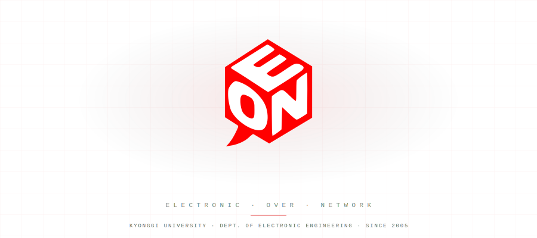

  

## EoN이란?

경기대학교 전자공학과 학술 동아리 EoN에 오신 것을 환영합니다!

> **꿈을 찾다, 아이디어를 현실로 만들다**  
> 전공 H/W 지식과 동아리 S/W 지식을 융합하여 새로운 가치를 탐구하는 학술 동아리입니다.

---

## Main Interests

**하드웨어와 소프트웨어의 경계를 허물고, 최신 기술 트렌드를 연구합니다.**

<table width="100%">
  <tr>
    <td width="50%" valign="top">
      <h3>🤖 AI Conference</h3>
      <ul>
        <li><b>세부 분야:</b> Deep Learning, Computer Vision, NLP</li>
        <li><b>관련 활동:</b> 최신 논문 리뷰 및 글로벌 컨퍼런스 트렌드 파악</li>
      </ul>
    </td>
    <td width="50%" valign="top">
      <h3>🏆 Contests</h3>
      <ul>
        <li><b>세부 분야:</b> 학술대회 및 ICT 공모전</li>
        <li><b>관련 활동:</b> Hanium ICT 멘토링, 임베디드 SW 경진대회 등</li>
      </ul>
    </td>
  </tr>
  <tr>
    <td width="50%" valign="top">
      <h3>💻 Software</h3>
      <ul>
        <li><b>세부 분야:</b> AI, VLA (Vision-Language-Action), Edge AI</li>
        <li><b>관련 활동:</b> 알고리즘 설계, 모델 최적화 및 배포</li>
      </ul>
    </td>
    <td width="50%" valign="top">
      <h3>⚙️ Hardware</h3>
      <ul>
        <li><b>세부 분야:</b> 반도체 공정 및 설계 (Frontend/Backend)</li>
        <li><b>관련 활동:</b> Verilog HDL, Layout Design (KLayout), 공정 분석</li>
      </ul>
    </td>
  </tr>
</table>

---

## 📜 History

| 연도 | 내용 |
|------|------|
| **2004.03** | C언어 강의 시작 (강사: 김기용 박사님) |
| **2004.06** | 심도 있는 S/W 학습을 위한 스터디 모임 구성 (C++, Win32 API, 네트워크 프로그래밍 등) |
| **2005.03** | **EoN 동아리 정식 발족** — 초대 멤버: 김주한, 김평수, 유용출, 황두현(00), 김현정(01), 김승현(02), 이미나(03) |
| **Present** | 지능형 시스템 및 반도체 설계를 포함한 융복합 학술 활동 지속 중 |

---

## Tech Stack

---

## Contact

   

   

Copyright © 2026 EoN - Electronic Over Network. All rights reserved. | Kyonggi University
